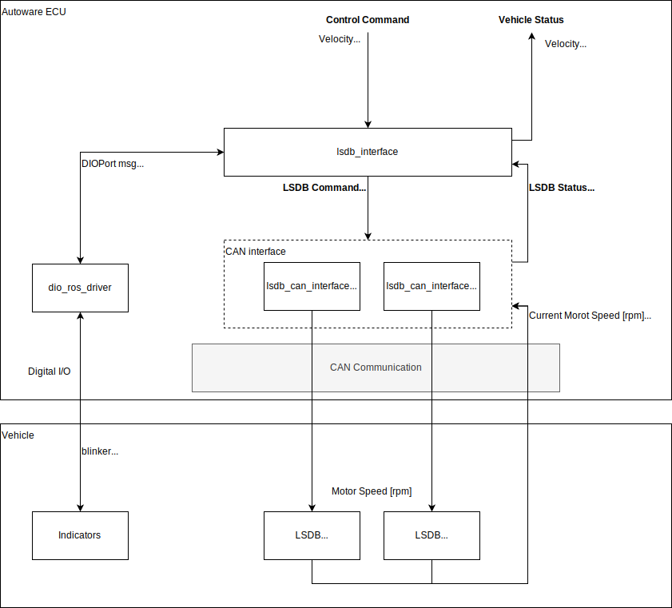

# lsdb_interface
The controller packages for vehicles using LSDB motor controller.

# Overview

# Directory Structure

| Directory Nmae                                  | Description |
| :---------------------------------------------- | :---------- |
| [lsdb_can_interface](lsdb_can_interface/)       | ROS2 interface package for lsdb motor controller using CAN communication. |
| [lsdb_interface](lsdb_interface/)               | Interface package for connecting autoware and lsdb ROS2 interface. |
| [lsdb_msgs](lsdb_msgs/)                         | Custom ROS2 msg files for the lsdb interface. |
| [lsdb_serial_interface](lsdb_serial_interface/) | ROS2 interface package for lsdb motor controller using serial communication.(old package) |
